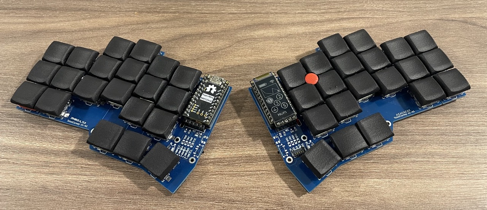
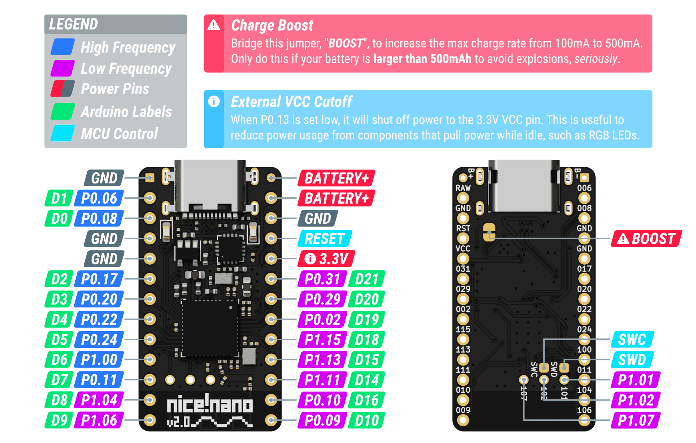
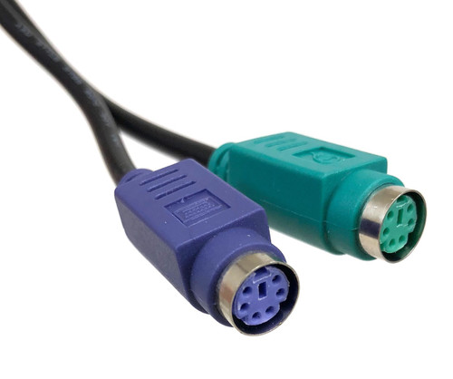
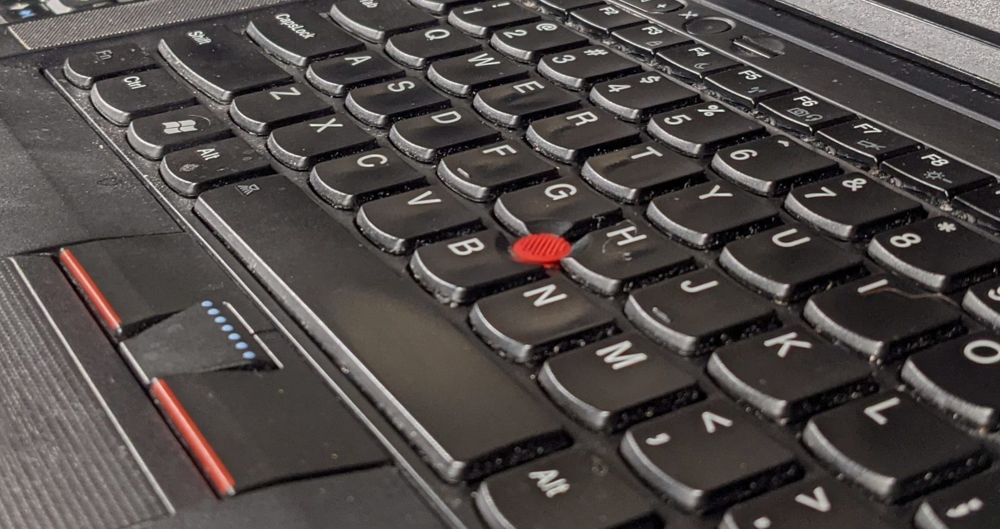
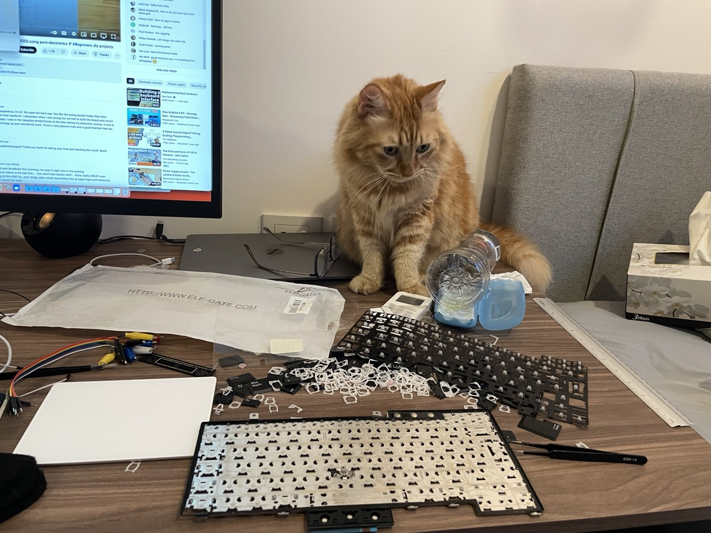
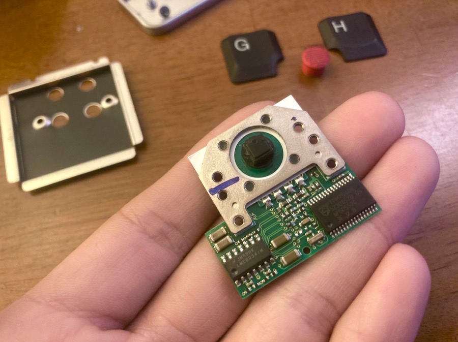
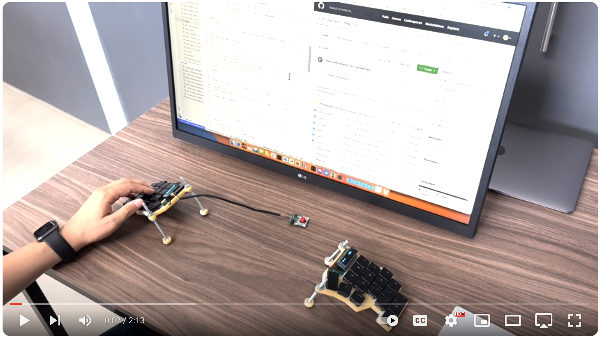

# PS/2 Mouse & TrackPoint Driver for zmk keyboards

This is a driver module that adds support for PS/2 mouse-pointing devices to DIY keyboards running the [zmk firmware](https://zmk.dev).

You can use this driver for any pointing device that uses the PS/2 protocol, such as an actual mouse, touchpad, or trackball.

But it's most commonly used with TrackPoints such as this one:



It is a [zmk module](#zmk-module) version of my original PRs:

1. [zmk PR #1751](https://github.com/zmkfirmware/zmk/pull/1751) - Add PS/2 Mouse / TrackPoint / Trackpad / Trackball support
2. [zephyr PR #15](https://github.com/zmkfirmware/zephyr/pull/15) - Add PS/2 GPIO Bit-banging driver

If you are interested in how this project came to be, [check out the development journey "blog post" at the bottom](#blog-post).

## Table Of Contents <!-- omit from toc -->

- [1. Features](#1-features)
  - [1.1. Great performance through the use of the UART chip](#11-great-performance-through-the-use-of-the-uart-chip)
  - [1.2. Automatic Layer Toggling on mouse movement](#12-automatic-layer-toggling-on-mouse-movement)
  - [1.3. TrackPoint related features](#13-trackpoint-related-features)
    - [1.3.1. TrackPoint Configuration with key behaviors](#131-trackpoint-configuration-with-key-behaviors)
    - [1.3.2. Power-On-Reset Support](#132-power-on-reset-support)
    - [1.3.3. Press-To-Select (Clicking by pressing the TrackPoint)](#133-press-to-select-clicking-by-pressing-the-trackpoint)
- [2. Setup Instructions for users of previous versions](#2-setup-instructions-for-users-of-previous-versions)
- [3. Setup Instructions for new users](#3-setup-instructions-for-new-users)
  - [3.1. Check out the example zmk-config](#31-check-out-the-example-zmk-config)
  - [3.2. Test your TrackPoint with the pre-built firmware](#32-test-your-trackpoint-with-the-pre-built-firmware)
  - [3.3. How to set up your zmk-config for the driver](#33-how-to-set-up-your-zmk-config-for-the-driver)
    - [3.3.1. Create a zmk-config (if you don't have one already)](#331-create-a-zmk-config-if-you-dont-have-one-already)
    - [3.3.2. Create a custom shield definition](#332-create-a-custom-shield-definition)
    - [3.3.3. Change the central side](#333-change-the-central-side)
    - [3.3.4. Add the TrackPoint config files](#334-add-the-trackpoint-config-files)
  - [3.4. How to configure the driver](#34-how-to-configure-the-driver)
    - [3.4.1. Choose the PS/2 driver: UART vs GPIO](#341-choose-the-ps2-driver-uart-vs-gpio)
    - [3.4.2. Which pins to use](#342-which-pins-to-use)
    - [3.4.3. TrackPoint Power-On-Reset](#343-trackpoint-power-on-reset)
    - [3.4.4. Configure other settings](#344-configure-other-settings)
    - [3.4.5. Add the PS/2 driver module to your `config/west.yml`](#345-add-the-ps2-driver-module-to-your-configwestyml)
  - [3.5. Switch to a zmk fork with mouse support](#35-switch-to-a-zmk-fork-with-mouse-support)
  - [3.6. Build your firmware using GitHub Actions](#36-build-your-firmware-using-github-actions)
  - [3.7. Or, build your firmware using a local toolchain (for developers only)](#37-or-build-your-firmware-using-a-local-toolchain-for-developers-only)
- [4. Troubleshooting](#4-troubleshooting)
  - [4.1. If the firmware fails to build](#41-if-the-firmware-fails-to-build)
    - [4.1.1. Check if you using a zmk fork that doesn't include mouse support](#411-check-if-you-using-a-zmk-fork-that-doesnt-include-mouse-support)
    - [4.1.2. error: too few arguments to function 'zmk_keymap_layer_activate'](#412-error-too-few-arguments-to-function-zmk_keymap_layer_activate)
    - [4.1.3. fatal error: zmk/mouse/types.h: No such file or directory](#413-fatal-error-zmkmousetypesh-no-such-file-or-directory)
    - [4.1.4. Other build errors](#414-other-build-errors)
  - [4.2. If the mouse or TrackPoint "doesn't work"](#42-if-the-mouse-or-trackpoint-doesnt-work)
    - [4.2.1. Check if the driver is compiled into the firmware](#421-check-if-the-driver-is-compiled-into-the-firmware)
    - [4.2.2. Check if the mouse or TrackPoint communicates with the firmware](#422-check-if-the-mouse-or-trackpoint-communicates-with-the-firmware)
    - [4.2.3. If the driver can't communicate with the pointing device](#423-if-the-driver-cant-communicate-with-the-pointing-device)
    - [4.2.4. If the pointing device is initialized, but the mouse is not moving or moving only on USB](#424-if-the-pointing-device-is-initialized-but-the-mouse-is-not-moving-or-moving-only-on-usb)
  - [4.3. If you get bad battery life](#43-if-you-get-bad-battery-life)
  - [4.4. If your split keyboard halves refuse to pair](#44-if-your-split-keyboard-halves-refuse-to-pair)
- [5. Development Journey Blog \& Implementation Details](#5-development-journey-blog--implementation-details)
- [6. Related Resources \& Projects](#6-related-resources--projects)
  - [6.1. My Other TrackPoint Related Repos](#61-my-other-trackpoint-related-repos)
  - [6.2. Zmk Related](#62-zmk-related)
  - [6.3. TrackPoint Info](#63-trackpoint-info)
  - [6.4. How to figure out TrackPoint Pinout](#64-how-to-figure-out-trackpoint-pinout)
  - [6.5. Datasheets](#65-datasheets)
  - [6.6. Other Info](#66-other-info)

## 1. Features

In addition to supporting all PS/2 pointing devices, the driver has a few noteworthy features...

### 1.1. Great performance through the use of the UART chip

PS/2 is a very old protocol and unfortunately not used in many devices anymore (apart from TrackPoints). Therefore most microcontrollers don't include hardware chips that handle the communication with PS/2 devices (unlike, for example, SPI).

TrackPoints send data at a rate of almost 15,000 times per second and unfortunately, the most popular controllers in the zmk community are not able to keep up with the communication, at this speed, when you process it using GPIO interrupts.

However, I found a way to take advantage of the UART hardware chip to process the data. This ensures great performance even without proper PS/2 hardware support on the MCU.

If you are interested in how this works, [you can read more about it in the development journey section](#blog-post).

### 1.2. Automatic Layer Toggling on mouse movement

You can also automatically toggle a layer whenever there is mouse movement. This way you can turn your thumb cluster keys into mouse buttons whenever you touch the TrackPoint.

### 1.3. TrackPoint related features

#### 1.3.1. TrackPoint Configuration with key behaviors

TrackPoints have various settings that can change the algorithm for the mouse movement, but recompiling and reflashing your keyboard to test them is very tedious and makes comparing settings very hard.

So, I added the ability to adjust these settings at run-time through key behaviors, such as `&mms MS_TP_SENSITIVITY_INCR`. This way you can easily find the right settings for your keyboard and preference.

You can adjust the following settings:

- Sensitivity
- Negative Inertia
- Transfer Function Upper Plateau Speed (value6)
- The pressure sensitivity for press-to-select

Read the [TrackPoint System Version 4.0 Engineering Specification](https://blogs.epfl.ch/icenet/documents/Ykt3Eext.pdf) to better understand how these settings affect the mouse behavior.

And check out the instructions in [the example zmk-config](https://github.com/infused-kim/kb_zmk_ps2_mouse_trackpoint_driver-zmk_config#2-how-to-adjust-tackpoint-settings) to see how to use the settings key layer.

#### 1.3.2. Power-On-Reset Support

Many TrackPoints require an additional reset pin. Most people in the ergo keyboard community [create a reset circuit that uses resistors and capacitors to implement the functionality](https://github.com/alonswartz/trackpoint#2-create-the-reset-circuit-rc).

This allows you to save a pin and use the TrackPoint with a firmware that doesn’t support power-on-reset.

But if you have a pin to spare, you can connect the TrackPoint directly and configure this driver to perform the power-on-reset.

#### 1.3.3. Press-To-Select (Clicking by pressing the TrackPoint)

TrackPoints have an interesting feature that allows you to click by pressing a little harder on the TrackPoint and this driver lets you enable it.

But, unfortunately, not all TrackPoints support this feature. My older Lenovo T430 TP supports it, but my newer, red T460S TP does not.

## 2. Setup Instructions for users of previous versions

If you used the previous zmk fork version of this driver, then you only need to make a few small changes.

But I would recommend you check out the [new example zmk-config, which shows step-by-step how to set up the module](https://github.com/infused-kim/kb_zmk_ps2_mouse_trackpoint_driver-zmk_config/).

I made some changes to how the config is structured, which makes it more flexible and easier to use.

You can also check how I upgraded my personal config from the old zmk fork to this new module in these commits:

1. [Converted zmk-config to new module structure](https://github.com/infused-kim/zmk-config/commit/77b48aa40e95505516053652929936b7a2313cbc)
2. [Added minimal changes to switch to new PS/2 mouse driver module](https://github.com/infused-kim/zmk-config/commit/b12931a7145445e757812d09106d5896cc99e623)
3. [Added full changes to switch](https://github.com/infused-kim/zmk-config/commit/47bd2cc46de99f722e57e27e3a28d7ea367a880a)

But, here are the minimum changes you need to make.

### Change the name of the input-listener... <!-- omit from toc -->

In `boards/shields/your_keyboard/your_keyboard.dtsi` change from `zmk,input-listener` to `zmk,input-listener-ps2`:

```diff
/ {
    mouse_ps2_input_listener: mouse_ps2_input_listener {
-       compatible = "zmk,input-listener";
+       compatible = "zmk,input-listener-ps2";
        status = "disabled";

        device = <&mouse_ps2>;
    };
};
```

### Adjust your west.yaml to use the module <!-- omit from toc -->

In your `config/west.yml`, you have to switch to a fork that has [zmk PR #2027 (Mouse pointer movement/scrolling)](https://github.com/zmkfirmware/zmk/pull/2027).

In the full setup instructions below you can find a list of forks with their advantages and disadvantages.

In addition to that, you also need to add this module to the `config/west.yml`:

```diff
manifest:
  remotes:
    - name: zmkfirmware
      url-base: https://github.com/zmkfirmware
+   - name: infused-kim
+     url-base: https://github.com/infused-kim

  projects:
    - name: zmk
-     remote: zmkfirmware
-     revision: main
+     remote: infused-kim
+     revision: pr-testing/mouse_ps2_module_base
      import: app/west.yml

+   # Module for PS/2 mouse & TP driver
+   - name: kb_zmk_ps2_mouse_trackpoint_driver
+     remote: infused-kim
+     revision: main

  self:
    path: config
```

**3. Change the config if you are using urob's fork...**

If you are using urob's zmk fork, please also edit your keyboard's `keyboard_name.conf` file and add to it:

```conf
CONFIG_ZMK_INPUT_MOUSE_PS2_ENABLE_UROB_COMPAT=y
```

Finally, build the firmware using GitHub Actions or the toolchain. No further changes to the configuration should be necessary.

Or continue reading for the full instructions...

## 3. Setup Instructions for new users

### 3.1. Check out the example zmk-config

The configuration is fairly complex, but I created [an example zmk-config that walks you step-by-step through the process](https://github.com/infused-kim/kb_zmk_ps2_mouse_trackpoint_driver-zmk_config/).

You can either fork it or you can [look at the commit history](https://github.com/infused-kim/kb_zmk_ps2_mouse_trackpoint_driver-zmk_config/commits/main/) and just replicate it for your keyboard.

### 3.2. Test your TrackPoint with the pre-built firmware

In addition to that, you can find a pre-compiled firmware in the [releases section of the example zmk config](https://github.com/infused-kim/kb_zmk_ps2_mouse_trackpoint_driver-zmk_config/releases).

The pre-compiled version is configured for a corne keyboard, but should be compatible with any keyboard that uses the same pins (such as Chocofi and many more).

You can also use it to test your TrackPoint with a breadboard if you are still in the design stage of your keyboard.

You can find the pins that can be used for the TP with the pre-compiled firmware in the [example zmk-config's readme](https://github.com/infused-kim/kb_zmk_ps2_mouse_trackpoint_driver-zmk_config/#1-pre-built-firmware).

### 3.3. How to set up your zmk-config for the driver

To help you better understand the example zmk-config, here are the things you have to do to set it up.

#### 3.3.1. Create a zmk-config (if you don't have one already)

If you don't have a zmk-config yet, then you can [follow the zmk documentation for instructions on how to create a new config](https://zmk.dev/docs/user-setup).

> [!TIP]
>
> **For long-time zmk users**
>
> The zmk-config format was recently updated to be a module. If you created your zmk config a long time ago, you may need to update your zmk-config directory structure.
>
> Just create a new zmk-config and compare whether your config matches the latest version.
>
> One of the big differences in my config was that I had the shield definitions in `zmk-config/config/boards/shields/`, but in the new version they are in `zmk-config/boards/shields/` (it's in the root dir instead of the `config` dir).
>
> Another one was the missing `zmk-config/zephyr/` dir, but there may be more.
>
> You can [check out this commit in my personal zmk-config](https://github.com/infused-kim/zmk-config/commit/77b48aa40e95505516053652929936b7a2313cbc) to see what I had to do to upgrade my config to the new module format.

#### 3.3.2. Create a custom shield definition

Zmk supports different keyboards through `shield definitions`, which are stored in [app/boards/shields](https://github.com/zmkfirmware/zmk/tree/main/app/boards/shields).

These shield definitions specify how many keys a keyboard has, what controller pins all the components are using, etc.

These definitions are then combined with your keymap to build the full firmware.

Zmk supports many keyboards (`shields`) out of the box, but to set up the mouse / TrackPoint driver, you'll need to create a custom shield in your `zmk-config/` directory.

I strongly encourage you to look at the [look at the commit history of the example zmk-config](https://github.com/infused-kim/kb_zmk_ps2_mouse_trackpoint_driver-zmk_config/commits/main/) to see how to create the custom shield definition.

There are a lot of files and strings that need to be renamed. But, here's a quick summary of what you will need to do:

##### Copy a shield definition into your zmk-config directory <!-- omit from toc -->

To make the process easier, you can just use the existing definition from the zmk code.

For example, if you are using a corne (or corne-compatible keyboard), copy the [corne shield folder](https://github.com/zmkfirmware/zmk/tree/main/app/boards/shields/corne) into your `zmk-config/boards/shields/your_keyboard` directory.

**IMPORTANT:** Make sure to give the shield a new and unique name, such as `corne_tp`.

##### Adjust all the file names <!-- omit from toc -->

Next, rename all file names to use the new name, such as `corne_right.overlay` -> `corne_tp_right.overlay`.

##### Rename the shield within all the files <!-- omit from toc -->

Next, make sure to rename the keyboard within all the files, such as...

- Make sure all `#include "some_file.dtsi"` statements use the correct, new file name
- Rename the strings in `Kconfig.defconfig` and `Kconfig.shield`
- Don't forget about the `your_keyboard.zmk.yml`
- Search for the old name in all other files as there may be more (depending on what keyboard's shield you copied from zmk)

Be careful in this step as there are many files and mistakes can lead to obscure errors. You can refer to my [example zmk-config commit history](https://github.com/infused-kim/kb_zmk_ps2_mouse_trackpoint_driver-zmk_config/commits/main/) to see what changes I had to make.

##### Rename your keymap and config <!-- omit from toc -->

Next, rename the files in your personal config directory (not the shield directory)...

- Keymap, such as `zmk-config/config/corne.keymap` -> `corne_tp.keymap`
- Config file, such as `zmk-config/config/corne.conf` -> `corne_tp.conf`

> [!IMPORTANT]
>
> The keymap and config files are present in both the `zmk-config/boards/shields` directory, as well as the `zmk-config/config` directory.
>
> You should always edit your keymap in the `zmk-config/config` directory. That's the one that is meant to be customized by the end user.
>
> The keymap in `zmk-config/boards/shields` is the default keymap that is used if the user doesn't specify his own, but should not be edited by end-users.

##### Build the firmware with the new shield to see if it's working <!-- omit from toc -->

Now, edit your `zmk-config/build.yaml` and change the shield name to your new name:

```diff
include:
  - board: nice_nano_v2
-   shield: corne_left
+   shield: corne_tp_left
  - board: nice_nano_v2
-   shield: corne_right
+   shield: corne_tp_right
```

##### Test build your config <!-- omit from toc -->

Finally, build your config to see if everything is still working. Just push the config to GitHub and it should build the firmware.

Make sure the firmware is working. You want to have a "known to work" checkpoint commit that you can return to if it stops building or working in one of the next steps.

#### 3.3.3. Change the central side

In zmk, split keyboards have a central and peripheral side. The central side is the actual brain of the keyboard, which connects to both your computer and the peripheral side. The peripheral just sends its key presses to the central half.

Currently, pointing devices must be connected to the central side and cannot be connected to the peripheral.

Most people want their pointing device or TrackPoint to be connected to the RIGHT side. But, by default, the central side is on the LEFT in zmk.

So, the solution is to change the shield configuration to configure the right side to act as the central half.

You do it by editing `zmk-config/boards/shields/your_keyboard/Kconfig.defconfig`:

```diff
-if SHIELD_YOUR_KEYBOARD_TP_LEFT
+if SHIELD_YOUR_KEYBOARD_TP_RIGHT

config ZMK_KEYBOARD_NAME
    default "YourKeyboard TP"

config ZMK_SPLIT_ROLE_CENTRAL
    default y

endif
```

#### 3.3.4. Add the TrackPoint config files

The next step is to add the TrackPoint configuration to the right files.

These files are quite long and complex. So, instead of explaining every line, I encourage you to look at the following commit [in the example zmk-config](https://github.com/infused-kim/kb_zmk_ps2_mouse_trackpoint_driver-zmk_config/commits/main/):

- Shield & Config: Added PS/2 Mouse & TrackPoint support

I added A LOT of comments throughout the config files to explain how everything works.

You will need to add the config in these places:

##### In the shield... <!-- omit from toc -->

- Edit the `zmk-config/boards/shields/your_keyboard/your_keyboard_right.overlay` (or the left one if that's where you are connecting your pointing device)

##### In your config directory... <!-- omit from toc -->

> [!TIP]
>
> Make sure you edit these files inside the `zmk-config/config/` directory. The same files also exist within the shield directory, but you should edit your personal keymap and config.

- Edit your keymap `zmk-config/config/your_keyboard_tp.keymap`
- Edit your config `zmk-config/config/your_keyboard_tp.conf`
- Add the new file `zmk-config/config/include/mouse_tp.dtsi`

### 3.4. How to configure the driver

All of the options are clearly explained with comments in [your_keyboard_right.overlay](https://github.com/infused-kim/kb_zmk_ps2_mouse_trackpoint_driver-zmk_config/blob/main/boards/shields/corne_tp/corne_tp_right.overlay), [mouse_tp.dtsi](https://github.com/infused-kim/kb_zmk_ps2_mouse_trackpoint_driver-zmk_config/blob/main/config/include/mouse_tp.dtsi) and [your_keyboard.conf](https://github.com/infused-kim/kb_zmk_ps2_mouse_trackpoint_driver-zmk_config/blob/main/config/corne_tp.conf).

But there are a few things I want to highlight here.

#### 3.4.1. Choose the PS/2 driver: UART vs GPIO

The nrf52 microchip, which is used by the nice!nano controller does not have hardware support for the PS/2 transmission protocol, which is used by TrackPoints.

This means that I had to implement the entire communication in software.

My first attempt was to use GPIO interrupts (hence the driver name `ps2_gpio`), but this approach was too slow on the nice!nano and led to errors in transmissions, which resulted in annoying, abrupt mouse movements and accidental clicks.

So, I developed a new driver that exploits the nice!nano's UART hardware chip to implement the PS/2 protocol at a much better performance.

The important thing to understand is:

- Both drivers are PS/2 drivers
- Both drivers work with TrackPoints
- You should use the UART driver if possible
- The only reasons to use the GPIO instead of the UART driver are...
  - If you are not using nice!nano, nice!nano clone, or another nrf52-based controller
  - Or your TrackPoint is using a clock frequency that is not compatible with the available UART baud rates

To enable the UART driver, simply make sure that this line is uncommented:

```c
#define MOUSE_PS2_DRIVER_UART
```

Or comment it out to enable the GPIO driver.

#### 3.4.2. Which pins to use

On the nrf52 microchip that the nice!nano uses, pins can be either high or low frequency.

On the [nice!nano pinout schematic](https://nicekeyboards.com/docs/nice-nano/pinout-schematic), the high-frequency pins have a blue box and the low-frequency pins have a purple box.



**PS/2 mouse devices will work on both types of pins**, but on low-frequency pins, they may cause Bluetooth interference.

So, it's better to use high-frequency pins. But, unless you are designing a keyboard from scratch, that's not always possible.

On many keyboards, that don't have under glow or backlight (such as the Chocofi), the high frequency `D1` and `D0` pins are not in use and are a great choice.

Alternatively, the low-frequency pins `D8`, `D9`, `D16`, and `D10` are ok options.

You can change the pins by editing these lines:

```c
#define MOUSE_PS2_PIN_SCL_PRO_MICRO <&pro_micro 16 GPIO_ACTIVE_HIGH>
#define MOUSE_PS2_PIN_SDA_PRO_MICRO <&pro_micro 10 GPIO_ACTIVE_HIGH>
#define MOUSE_PS2_PIN_SDA_PINCTRL <NRF_PSEL(UART_RX, 0, 9)>
```

Please refer to the comments in [zmk-config/boards/shields/your_keyboard/your_keyboard_right.overlay](https://github.com/infused-kim/kb_zmk_ps2_mouse_trackpoint_driver-zmk_config/blob/main/boards/shields/corne_tp/corne_tp_right.overlay) for detailed instructions.

You can also find more info in the [example zmk-config's README](https://github.com/infused-kim/kb_zmk_ps2_mouse_trackPoint_driver-zmk_config/).

#### 3.4.3. TrackPoint Power-On-Reset

Unlike most PS/2 devices, TrackPoints require an additional `Power-On-Reset` (`RST`) pin. A specific electric sequence must be sent to the TrackPoint to let it know that the voltage supply is stable.

The TrackPoint only powers on and allows communication with itself after this sequence is sent.

This driver implements a software implementation of this sequence, but it requires an additional, unused pin on your controller.

Low-frequency pins are fine for this. So, I suggest pin `D9` and you can find the option to enable it in the config file `zmk-config/boards/shields/your_keyboard/your_keyboard_right.overlay`.

Alternatively, you can also design a `Power-On-Reset Circuit`. You can do it on your keyboard PCB, a breakout board or even using a breadboard.

In that case, you can simply comment out the following line and the Power-On-Reset won't be enabled.

```c
// #define MOUSE_PS2_PIN_RST_PRO_MICRO <&pro_micro 9 GPIO_ACTIVE_HIGH>
```

You can [learn more about how to build a reset circuit here](https://github.com/alonswartz/trackpoint#2-create-the-reset-circuit-rc).

#### 3.4.4. Configure other settings

You can adjust more settings in [mouse_tp.dtsi](https://github.com/infused-kim/kb_zmk_ps2_mouse_trackpoint_driver-zmk_config/blob/main/config/include/mouse_tp.dtsi) as well as [your_keyboard.conf](https://github.com/infused-kim/kb_zmk_ps2_mouse_trackpoint_driver-zmk_config/blob/main/config/corne_tp.conf).

In `mouse_tp.dtsi`, you will find settings such as TP sensitivity, swapping of axes, etc. It's also where you configure automatic layer toggling on mouse movement.

You won't need to adjust most of the settings in `your_keyboard.conf`, but one option that's worth mentioning is `CONFIG_ZMK_INPUT_MOUSE_PS2_ENABLE_UROB_COMPAT`.

It is necessary if you want to use [urob's popular zmk fork](https://github.com/urob/zmk).

<a name="zmk-module"></a>

#### 3.4.5. Add the PS/2 driver module to your `config/west.yml`

This version of the driver is a zmk module.

Modules are like a plugin system. They allow you to add beta features without needing to modify and update a fork of zmk.

This means when new features or updates are added to the original version of zmk main, you don't need to wait for the developer of your beta feature (such as me) to update their fork with the new functionality that was added to zmk main.

If you are building your firmware using GitHub Actions, then you can just edit your `zmk-config/config/west.yml`.

```diff
manifest:
  remotes:
    - name: zmkfirmware
      url-base: https://github.com/zmkfirmware
+   - name: infused-kim
+     url-base: https://github.com/infused-kim
  projects:
    - name: zmk
      remote: zmkfirmware
      revision: main
      import: app/west.yml
+
+   # zmk module for PS/2 mouse / TP driver
+   - name: kb_zmk_ps2_mouse_trackpoint_driver
+     remote: infused-kim
+     revision: main

  self:
    path: config
```

If you are a developer and are building using a local toolchain, please look for the developer instructions further down.

### 3.5. Switch to a zmk fork with mouse support

Even though the purpose of zmk modules is to not depend on any zmk forks, at the moment that's not entirely possible.

This module depends on [zmk PR #2027 (Mouse pointer movement/scrolling)](https://github.com/zmkfirmware/zmk/pull/2027), which is still in active development and has not been merged into zmk main yet.

This means you must use a fork of zmk that has this PR merged into it.

##### Options for zmk forks with mouse support: <!-- omit from toc -->

1. [petejohanson - feat/pointers-move-scroll](https://github.com/petejohanson/zmk/tree/feat/pointers-move-scroll)
   - Pete is the creator of zmk and is currently the main developer of the mouse pointing feature in zmk.
   - He usually updates his fork very soon after new features are added to zmk main.
   - This is the best version to use if you want to stay as up-to-date and as close as possible to zmk's original version.
2. [infused-kim - pr-testing/mouse_ps2_module_base](https://github.com/infused-kim/zmk/tree/pr-testing/mouse_ps2_module_base)
   - This is my zmk fork of `petejohanson's feat/pointers-move-scroll` that is "last known to work" with this module.
   - I won't update it frequently. So it's not good if you want to stay up-to-date with the latest and greatest zmk has to offer.
   - But if Pete changes his `feat/pointers-move-scroll` implementation in a major way and it becomes incompatible with this module, then this fork will continue to work for you.
   - I recommend you start with this fork and test your configuration with it first. Once it's working and you know your config is good, you can switch to Pete's to get future updates.
3. [urob - main](https://github.com/urob/zmk)
   - Urob's zmk fork is very popular in the community because he adds a lot of cool beta features.
   - It has traditionally been the recommended fork for people who wanted to add mouse support to their keyboards because urob frequently updates it with the latest improvements that get added to the original zmk main version.
   - If you are not familiar with it, you should definitely check out [his fork](https://github.com/urob/zmk) and his [zmk-config](https://github.com/urob/zmk-config) to learn about all these extra features and especially his `timeless homerow mods`.
   - Please also enable `CONFIG_ZMK_INPUT_MOUSE_PS2_ENABLE_UROB_COMPAT=y` to account for API changes in urob's fork.
4. [infused-kim - pr-testing/mouse_ps2_module_base_urob](https://github.com/infused-kim/zmk/tree/pr-testing/mouse_ps2_module_base_urob)
   - This fork is the same as #2 above but also includes urob's features on top of the latest mouse implementation.
   - Please also enable `CONFIG_ZMK_INPUT_MOUSE_PS2_ENABLE_UROB_COMPAT=y` to account for API changes in urob's fork.

##### How to add the zmk fork to your `config/west.yml` <!-- omit from toc -->

Edit your `zmk-config/config/west.yml`:

```diff
manifest:
  remotes:
    - name: zmkfirmware
      url-base: https://github.com/zmkfirmware
    - name: infused-kim
      url-base: https://github.com/infused-kim
+   - name: petejohanson
+     url-base: https://github.com/petejohanson
+   - name: urob
+     url-base: https://github.com/urob
  projects:
    - name: zmk
-     remote: zmkfirmware
-     revision: main
+     remote: infused-kim
+     revision: pr-testing/mouse_ps2_module_base
      import: app/west.yml

+   # zmk module for PS/2 mouse / TP driver
+   - name: kb_zmk_ps2_mouse_trackpoint_driver
+     remote: infused-kim
+     revision: main

  self:
    path: config
```

I kept the diff above concise, but you can find the full list of all recommended forks with explanations [in the example zmk-config's west.yml](https://github.com/infused-kim/kb_zmk_ps2_mouse_trackpoint_driver-zmk_config/blob/main/config/west.yml).

### 3.6. Build your firmware using GitHub Actions

This should be everything you need to configure. If you are using GitHub Actions, push your zmk-config and you will hopefully get a successful build.

If not, please refer to the troubleshooting section below.

### 3.7. Or, build your firmware using a local toolchain (for developers only)

> [!NOTE]
>
> This sub-section is for developers who are building zmk locally on their computers instead of using GitHub Actions. Most people can ignore this sub-section.

#### Set up the toolchain <!-- omit from toc -->

Follow the [toolchain setup instructions in the zmk documentation](https://zmk.dev/docs/development/setup).

#### Add the zmk-config to the toolchain (docker only) <!-- omit from toc -->

Create a volume with the directory where you will store the zmk-config:

```bash
docker volume create --driver local -o o=bind -o type=none -o device="/full/path/to/your/zmk-config/" zmk-config
```

#### Add this module to the toolchain (docker only) <!-- omit from toc -->

At the time of publishing, the docker VSCode toolchain is not set up to work with modules yet.

First, create a volume with the directory of your zmk-config:

```bash
docker volume create --driver local -o o=bind -o type=none -o device="/full/path/to/your/zmk-modules/" zmk-modules
```

Make sure this module is cloned into that `zmk-modules` directory.

Next, edit in your zmk clone `zmk/.devcontainer/devcontainer.json`:

```diff
{
  "name": "ZMK Development",
  [...]
  "mounts": [
    "type=volume,source=zmk-root-user,target=/root",
    "type=volume,source=zmk-config,target=/workspaces/zmk-config",
+   "type=volume,source=zmk-modules,target=/workspaces/zmk-modules",
    "type=volume,source=zmk-zephyr,target=${containerWorkspaceFolder}/zephyr",
    "type=volume,source=zmk-zephyr-modules,target=${containerWorkspaceFolder}/modules",
    "type=volume,source=zmk-zephyr-tools,target=${containerWorkspaceFolder}/tools"
  ],
  [...]
}
```

Then, in VSCode press `Command + Shift + P` and execute the command `Dev Containers: Rebuild Without Cache and Reopen in Container`.

Once the container is rebuilt, you can delete the above line from your `devcontainer.json` so that it doesn't pollute your git history. The container will continue mounting the `zmk-modules/` volume as long as you don't rebuild it.

#### Switch to a branch that has the mouse PR <!-- omit from toc -->

Don't forget to switch the zmk code branch to one that has the mouse PR (see the previous sections for details).

#### Build the firmware <!-- omit from toc -->

Run the build command...

```bash
west build -d build/corne_tp/right -p -b nice_nano_v2 -- -DZMK_EXTRA_MODULES="/workspaces/zmk-config/;/workspaces/zmk-modules/kb_zmk_ps2_mouse_trackpoint_driver/" -DZMK_CONFIG="/workspaces/zmk-config/config" -DSHIELD="corne_tp_right"
```

The important thing to note here is that you have to add the `/workspaces/zmk-config/` to your `-DZMK_EXTRA_MODULES` and use `;` as the separator between multiple modules.

And `-DZMK_CONFIG` must include not just the path to the `zmk-config`, but also the sub-directory `zmk-config/config`.

You can [learn more in the zmk dev documentation](https://zmk.dev/docs/development/build-flash#building-with-external-modules).

## 4. Troubleshooting

### 4.1. If the firmware fails to build

Here are some common build errors that you might encounter and how to solve them.

#### 4.1.1. Check if you using a zmk fork that doesn't include mouse support

If you get an error like this...

```c
-- Found devicetree overlay: /workspaces/zmk-config/config/corne_tp.keymap
In file included from <command-line>:
/workspaces/zmk-config/config/corne_tp.keymap:32:12: fatal error: behaviors/mouse_keys.dtsi: No such file or directory
   32 |   #include <behaviors/mouse_keys.dtsi>
      |            ^~~~~~~~~~~~~~~~~~~~~~~~~~~
compilation terminated.
```

Then you are most likely using a zmk fork that doesn't have the mouse PR merged. See the instructions above on [how to switch the fork in config/west.yml](https://github.com/infused-kim/kb_zmk_ps2_mouse_trackpoint_driver-zmk_config/blob/main/config/west.yml).

#### 4.1.2. error: too few arguments to function 'zmk_keymap_layer_activate'

If you get an error like this...

```c
config/kb_zmk_ps2_mouse_trackpoint_driver/src/mouse/input_listener_ps2.c
/__w/zmk-config/zmk-config/kb_zmk_ps2_mouse_trackpoint_driver/src/mouse/input_listener_ps2.c: In function 'zmk_input_listener_ps2_layer_toggle_activate_layer':
/__w/zmk-config/zmk-config/kb_zmk_ps2_mouse_trackpoint_driver/src/mouse/input_listener_ps2.c:284:9: error: too few arguments to function 'zmk_keymap_layer_activate'
  284 |         zmk_keymap_layer_activate(config->layer_toggle);
      |         ^~~~~~~~~~~~~~~~~~~~~~~~~
compilation terminated due to -Wfatal-errors.
```

Then you either are using urob's fork, but didn't enable `CONFIG_ZMK_INPUT_MOUSE_PS2_ENABLE_UROB_COMPAT`.

OR you did enable the option, but are not using his fork.

Edit your keyboard's `keyboard_name.conf` file and adjust this option depending on which fork you are using:

```conf
CONFIG_ZMK_INPUT_MOUSE_PS2_ENABLE_UROB_COMPAT=y
```

#### 4.1.3. fatal error: zmk/mouse/types.h: No such file or directory

If you are getting an error like...

```c
/workspaces/zmk-modules/kb_zmk_ps2_mouse_trackpoint_driver/src/mouse/input_listener_ps2.c:20:10: fatal error: zmk/mouse/types.h: No such file or directory
   20 | #include <zmk/mouse/types.h>
      |          ^~~~~~~~~~~~~~~~~~~
compilation terminated.
```

Then, it's a sign that you are building using a zmk fork that is using an outdated version of the [zmk mouse PR #2027](https://github.com/zmkfirmware/zmk/pull/2027).

#### 4.1.4. Other build errors

It's possible that this module has become incompatible with the latest zmk version or the [zmk mouse PR](https://github.com/zmkfirmware/zmk/pull/2027).

I maintain [a branch in my fork, that is known to be compatible](https://github.com/infused-kim/zmk/tree/pr-testing/mouse_ps2_module_base), in case this happens. You can find it in the [example zmk-config's west.yml](https://github.com/infused-kim/kb_zmk_ps2_mouse_trackpoint_driver-zmk_config/blob/main/config/west.yml)

If your build succeeds after switching to that known branch, then the issue is likely an incompatiblity with the new zmk code. Please open a GitHub issue or message me on Discord to let me know about the incompatibility.

### 4.2. If the mouse or TrackPoint "doesn't work"

The first thing you should do is enable logging in your keyboard config and connect the keyboard through USB. You can [use the options under the logging section in this example](https://github.com/infused-kim/kb_zmk_ps2_mouse_trackpoint_driver-zmk_config/blob/14b3102d969efb2fc708bba1cfc85eb1c34ac94a/config/corne_tp.conf#L14).

Make sure to enable `CONFIG_ZMK_LOGGING_MINIMAL=y` or you will get an overwhelming amount of logs.

If you are using the pre-built firmware of the example zmk-config, then you don't need to recompile it, because the options are already enabled.

Then [follow the instructions here to view the logs](https://zmk.dev/docs/development/usb-logging).

#### 4.2.1. Check if the driver is compiled into the firmware

If you make a mistake with the configuration, it's possible the driver isn't even compiled into the firmware and never executes.

The best way to see, if that's the case, is to look at the log for related logs.

You want to look for lines like these:

```log
[...]

[00:00:00.404,663] <inf> ps2_uart: Initializing ps2_uart driver with pins... SCL: P0.06; SDA: P0.08; SDA Pinctrl: P0.08
[00:00:00.404,724] <inf> ps2_uart: UART device is ready
[00:00:00.404,754] <inf> ps2_uart: Disabling callback...

[...]

[00:00:01.384,368] <inf> zmk: Performing Power-On-Reset on pin P0.09...
[00:00:01.984,466] <inf> zmk: Waiting for mouse to connect...
[00:00:01.984,497] <inf> zmk: Trying to initialize mouse device (attempt 1 / 10)
```

You can also try searching the logs for `ps2_uart` pr `ps2_gpio`.

If you can see them, it means your firmware was compiled with mouse support and the driver is at least trying to initialize the mouse device.

If you don’t see these, then you likely did something wrong in the configuration. Double-check the setup instructions again.

#### 4.2.2. Check if the mouse or TrackPoint communicates with the firmware

If you do see the initialization, but it’s not working, then check what's happening with the communication.

It should look something like the log below. I have added comments so that you know what to look for.

```bash
[...]

# If you don't see this message, then you might need to increase the log delay with:
# `CONFIG_LOG_PROCESS_THREAD_STARTUP_DELAY_MS=3000`
[00:00:00.404,663] <inf> ps2_uart: Initializing ps2_uart driver with pins... SCL: P0.06; SDA: P0.08; SDA Pinctrl: P0.08
[00:00:00.404,724] <inf> ps2_uart: UART device is ready
[00:00:00.404,754] <inf> ps2_uart: Disabling callback...

[...]

[00:00:00.423,828] <inf> zmk: Welcome to ZMK!

[...]

# These framing errors are ok as long as they only appear from time to time and don't affect
# the performance.
[00:00:00.679,077] <wrn> ps2_uart: UART RX detected error for byte 0xaa: Framing error (4)


# If you are using a TrackPoint and don't have a reset circuit, please make sure your
# firmware is performing a Power-On-Reset sequence on the correct pin.
[00:00:01.384,368] <inf> zmk: Performing Power-On-Reset on pin P0.09...


# Look for this init sequence
[00:00:01.984,466] <inf> zmk: Waiting for mouse to connect...
[00:00:01.984,497] <inf> zmk: Trying to initialize mouse device (attempt 1 / 10)


# The mouse device should send 0xaa when it turns on and its self-assurance test is
# successful.
#
# If you see it send 0xfc, then it means your mouse device is not able to initialize itself.
#
# If the pointing device doesn't send anything, then the driver will try to initialize it 10
# times by sending it the 0xff command.
#
# See the sections below on how to troubleshoot that case.
[00:00:01.984,497] <inf> zmk: PS/2 Device passed self-test: 0xaa


# If the driver receives the self-test success 0xaa message, it continues like this...
[00:00:01.984,527] <inf> zmk: Reading PS/2 device id...
[00:00:01.984,527] <inf> zmk: Connected PS/2 device is a mouse...
[00:00:01.984,527] <inf> zmk: Connected device is a Trackpoint by IBM (0x01); Rom Version: 3E; Secondary ID: 0x0E


# The settings will only be restored if you configured non-default settings. So, you might
# not see these messages.
[00:00:01.991,058] <inf> zmk: Setting TP sensitivity to 135...
[00:00:02.002,777] <inf> zmk: Successfully set TP sensitivity to 135

# It's fine if there are write errors, because we are using GPIO interrupts instead
# of the UART chips for writes, which has performance issues on the nice!nano.
#
# But as long as the write is successful in one of the 5 attempts, that's fine.
[00:00:02.002,777] <inf> zmk: Setting TP inertia to 6...
[00:00:02.006,988] <err> ps2_uart: Failed to write value 0xe2: scl timeout
[00:00:02.007,019] <err> ps2_uart: Blocking write finished with failure for byte 0xe2 status: 3
[00:00:02.007,049] <wrn> ps2_uart: Attempting write re-try #2 of 5...
[00:00:02.011,505] <wrn> ps2_uart: Successfully wrote 0xe2 on try #2 of 5...
[00:00:02.020,019] <inf> zmk: Successfully set TP negative inertia to 6

# If your firmware successfully sends this command, then your pointing device should start
# sending mouse movement reports afterward
[00:00:02.065,032] <inf> zmk: Enabling data reporting and ps2 callback...
[00:00:02.069,244] <err> ps2_uart: Failed to write value 0xf4: scl timeout
[00:00:02.069,274] <err> ps2_uart: Blocking write finished with failure for byte 0xf4 status: 3
[00:00:02.069,305] <wrn> ps2_uart: Attempting write re-try #2 of 5...
[00:00:02.072,875] <wrn> ps2_uart: Successfully wrote 0xf4 on try #2 of 5...

# If you move your mouse, it should move on the computer.
#
# It won't log each movement for performance reasons unless you enable debug logging.

[...]

# But if you have auto-layer-toggling enabled, then it will show some information about
# that...
[00:00:08.984,313] <inf> zmk: Not activating mouse layer 3, because last mouse activity was 250ms ago
[00:00:10.580,169] <inf> zmk: Not activating mouse layer 3, because last mouse activity was 42ms ago
[00:00:10.848,449] <inf> zmk: Activating layer 3 due to mouse activity...
[00:00:15.222,473] <inf> zmk: Deactivating layer 3 due to mouse activity...
```

#### 4.2.3. If the driver can't communicate with the pointing device

Usually, the device will send the value `0xaa` or `0xfc` after it passes or fails its self-test.

It can happen that the driver doesn't "see" the value because the device might send it before our driver is ready.

Or the device just doesn't send it for whatever reason.

In both cases, the driver will attempt to send the `0xff` reset command to the device, which should cause the pointing device to re-initialize, perform the self-test, and send us the result.

The log looks like this in those cases:

```bash
[00:00:01.385,803] <inf> zmk: Performing Power-On-Reset on pin P0.09...
[00:00:01.985,900] <inf> zmk: Waiting for mouse to connect...
[00:00:01.985,931] <inf> zmk: Trying to initialize mouse device (attempt 1 / 10)

# The pointing device didn't send the 0xaa or 0xfc self-test result
[00:00:03.985,992] <wrn> ps2_uart: Data queue timed out...
[00:00:03.986,022] <wrn> zmk: Could not read PS/2 device self-test result: -116.

# Driver attempts to reset the device
[00:00:03.986,022] <inf> zmk: Trying to reset PS2 device...
[00:00:03.990,234] <err> ps2_uart: Failed to write value 0xff: scl timeout
[00:00:03.990,264] <err> ps2_uart: Blocking write finished with failure for byte 0xff status: 3

# It will attempt 5 times
[00:00:03.990,295] <wrn> ps2_uart: Attempting write re-try #2 of 5...
[00:00:03.996,246] <err> ps2_uart: Blocking write failed due to semaphore timeout for byte 0xff: -11
[00:00:03.996,276] <wrn> ps2_uart: Attempting write re-try #3 of 5...
[00:00:04.000,457] <err> ps2_uart: Failed to write value 0xff: scl timeout
[00:00:04.000,488] <err> ps2_uart: Blocking write finished with failure for byte 0xff status: 3
[00:00:04.000,518] <wrn> ps2_uart: Attempting write re-try #4 of 5...
[00:00:04.006,469] <err> ps2_uart: Blocking write failed due to semaphore timeout for byte 0xff: -11
[00:00:04.006,500] <wrn> ps2_uart: Attempting write re-try #5 of 5...
[00:00:04.010,711] <err> ps2_uart: Failed to write value 0xff: scl timeout
[00:00:04.010,742] <err> ps2_uart: Blocking write finished with failure for byte 0xff status: 3

# The send failed on all 5 attempts
[00:00:04.010,803] <err> zmk: Could not send reset cmd

# The driver will continue to try for a total of 10 times
[00:00:04.010,803] <inf> zmk: Trying to initialize mouse device (attempt 2 / 10)
[00:00:06.010,894] <wrn> ps2_uart: Data queue timed out...
[00:00:06.010,925] <wrn> zmk: Could not read PS/2 device self-test result: -116.

[...]

[00:00:40.111,145] <inf> zmk: Trying to initialize mouse device (attempt 10 / 10)
[00:00:42.111,236] <wrn> ps2_uart: Data queue timed out...
[00:00:42.111,267] <wrn> zmk: Could not read PS/2 device self-test result: -116.

# And then it gives up
[00:00:47.111,328] <err> zmk: Could not init a mouse in 10 attempts. Giving up. Power cycle the mouse and reset zmk to try again.
```

This issue could be caused by a few things...

##### Try to power cycle the device... <!-- omit from toc -->

This means, cutting all power to the keyboard by turning off the battery and disconnecting USB.

Re-connect it to USB and see if that helps.

##### Make sure the Power-On-Reset is sent (if you are using a TrackPoint) <!-- omit from toc -->

TrackPoints require a power-on-reset sequence before they start communicating.

If you are not using a hardware reset circuit, then make sure you have enabled the driver to perform the reset sequence.

You can see in the log if it is...

```bash
[00:00:01.385,803] <inf> zmk: Performing Power-On-Reset on pin P0.09...
```

You should also make sure that it's sending it on the correct pin and that the reset wire is connected to the correct pin on your TrackPoint.

The pin is logged in the "raw pin notation" (like P0.09), but in your `your_keyboard_right.overlay` it's configured using the "pro micro" notation. You can find both notations in the [nice!nano pinout schematic](https://nicekeyboards.com/docs/nice-nano/pinout-schematic).

##### Double check that you are using the correct SCL and SDA pins <!-- omit from toc -->

Perhaps you configured the wrong pins.

Make sure you read [the nice!nano pinout](https://nicekeyboards.com/docs/nice-nano/pinout-schematic) correctly for the orientation of your controller (components down or up).

You should also check the config to see if the `pro_micro notation` and the `pinctrl notation` match for the `SDA` pin (see the comments in the example zmk-config for more details).

The firmware also logs the configured pins. So, please make sure they are correct:

```bash
[00:00:00.404,663] <inf> ps2_uart: Initializing ps2_uart driver with pins... SCL: P0.06; SDA: P0.08; SDA Pinctrl: P0.08
[00:00:00.404,724] <inf> ps2_uart: UART device is ready
[00:00:00.404,754] <inf> ps2_uart: Disabling callback...
```

The pins are logged in the "raw pin notation" (like P0.09), but in your `your_keyboard_right.overlay` it's configured using the "pro micro" notation. You can find both notations in the [nice!nano pinout schematic](https://nicekeyboards.com/docs/nice-nano/pinout-schematic).

If you can't see those lines (but you do see the other TP communication attempts), then it likely means you need to increase the log delay with:

```config
CONFIG_LOG_PROCESS_THREAD_STARTUP_DELAY_MS=3000
```

##### Make sure your TrackPoint pinout is correct <!-- omit from toc -->

Currently, the most up-to-date [list of TrackPoint pinouts is on deskauthority](https://deskthority.net/wiki/TrackPoint_Hardware).

You can find more pinouts, such as for the red T460S TP, on the zmk discord in the #pointing-devices channel.

If you are using a TP, that doesn't have a known pinout, don't rely on published pinouts for the `PTPM754DR` chip.

Even with the same chip, the pinouts can vary significantly. You have to reverse engineer each individual TrackPoint.

Check out the bottom of this readme for a [list of resources I found useful for figuring out the pinout of my TrackPoint](https://github.com/infused-kim/kb_zmk_ps2_mouse_trackpoint_driver?tab=readme-ov-file#6-related-resources).

##### Try the PS/2 GPIO driver <!-- omit from toc -->

At this point, it's time to try the GPIO driver, because it could be that your pointing device is not compatible with the UART driver.

PS/2 and UART differ in the way they synchronize the data transmission. PS/2 uses a clock line and UART expects the host and peripheral to agree on a frequency.

The reason I was able to make the UART driver work is because of a lucky coincidence... Many TrackPoints and other pointing devices happen to use a clock frequency that is very similar to one of the frequencies UART supports.

But that doesn't mean that _all_ pointing devices use a compatible frequency. It's possible that your device is not working, because of that.

So, comment out the following line in your `zmk-config/boards/shields/corne_tp/corne_tp_right.overlay`:

```c
// #define MOUSE_PS2_DRIVER_UART
```

This will disable the UART driver and switch to the GPIO driver. No further changes to the configuration should be necessary.

See if the device can communicate. The GPIO driver doesn't work very well on the nice!nano, because the nice!nano can't process all the data fast enough.

If it's still not working, skip to the next section below.

But if it is working, even just a little bit, you can be sure that at least you know that your pointing device is working, the pinout is correct, etc.

You can then try to change the UART baud rate in [zmk-config/boards/shields/your_keyboard/your_keyboard_right.overlay](https://github.com/infused-kim/kb_zmk_ps2_mouse_trackpoint_driver-zmk_config/blob/main/boards/shields/corne_tp/corne_tp_right.overlay#L120) to `19200` or `9600`.

If those are not working, then, unfortunately, the device is not compatible with the UART driver.

You could try debugging it further with a logic analyzer or you can buy one of the known to be compatible devices.

##### Make sure the wires are soldered well <!-- omit from toc -->

Finally, make sure that the wires are soldered well. It can be difficult to solder the wires and the little pins on the TrackPoint.

I've had several cases where the wires were seemingly soldered properly and even had continuity when tested with a multimeter, but it still didn't work.

Re-soldering them always fixed the issue.

So, if all of the solutions above fail, try soldering the cables again on both sides.

And make sure to use soldering flux (not just within the solder, but "external") as it really helps to make sure you get a good connection.

##### Make sure to clean the solder flux <!-- omit from toc -->

Solder flux can be conductive and cause tiny shorts that are sometimes not measurable using a multimeter, but are still affecting the circuit.

Keep in mind that we are toggling the power in the data and clock lines on and off at a rate of 15,000 times per second to communicate with the TrackPoint. And flux can disrupt that process.

This is not a theoretical issue. This problem has affected my TrackPoints and other people on Discord have also experienced this. So don't ignore this solution.

You can solve it by cleaning both the TrackPoint PCB as well as your keyboard with isopropyl alcohol. It must be isopropyl even though it is a bit harder to get. I didn't have success with ethynol-based alcohol.

Make sure to clean both the TrackPoint PCB, any connection points on your keyboard PCB, and also the area where you connect the keyboard controller to the PCB.

##### Debug using a logic analyzer <!-- omit from toc -->

If it's still not working, then you need to look "inside the wires".

This can be accomplished using a [$5 device, called a logic analyzer](https://www.aliexpress.com/item/1005001417581550.html).

You can use the [saleae logic2](https://www.saleae.com/pages/downloads) or the open-source [sigrok PulseView](https://sigrok.org/wiki/PulseView).

Logic2 has better support for decoding of PS/2 signals, but even PulseView would be enough to figure out if the pointing device is sending any data.

You just want to make sure that the TrackPoint is sending any data at all and on what pins.

You can also use it to measure the cycle length on the clock line and then use the instructions in [your_keyboard_right.overlay](https://github.com/infused-kim/kb_zmk_ps2_mouse_trackpoint_driver-zmk_config/blob/main/boards/shields/corne_tp/corne_tp_right.overlay#L120) to calculate the correct UART baud rate for your device..

#### 4.2.4. If the pointing device is initialized, but the mouse is not moving or moving only on USB

If the logs show that your pointing device can communicate and got initialized just fine, but is still not working, then...

##### Try if the mouse moves when connected over USB instead of Bluetooth <!-- omit from toc -->

If it does work on USB, then try to re-pair your Bluetooth connection.

You can also try to [wipe the controller flash with reset firmware](https://zmk.dev/docs/troubleshooting#split-keyboard-halves-unable-to-pair). You can [download the reset firmware from my example zmk-config releases page](https://github.com/infused-kim/kb_zmk_ps2_mouse_trackpoint_driver-zmk_config/releases/).

##### Check if the mouse keys are working <!-- omit from toc -->

Next, try to isolate whether the problem lies within the pointing device driver or the zmk mouse implementation in general.

Add a layer with mouse keys to your keyboard and check if they work.

If the mouse keys don't work, then there is some other problem within your zmk config. Try to isolate it by building a firmware without this driver module and other modifications until you get it working. Then add this module again.

If they do work, then the problem lies with this driver...

##### Check the debug log <!-- omit from toc -->

Enable the following options...

```conf
CONFIG_ZMK_LOGGING_MINIMAL=y
CONFIG_PS2_LOG_LEVEL_DBG=y
CONFIG_UART_LOG_LEVEL_DBG=y
```

And observe the logs for hints.

### 4.3. If you get bad battery life

#### TrackPoint consumption <!-- omit from toc -->

The reality is that mouse devices use quite a lot of energy.

We have a few measurements of battery life for TrackPoints on Discord, [here](https://discord.com/channels/719497620560543766/845285481888743434/1221546346184577065), [here](https://discord.com/channels/719497620560543766/845285481888743434/1112863061188018256) and [here](https://discord.com/channels/719497620560543766/845285481888743434/1114213834689884180).

They show that it's around 3 to 3.85mA consumption.

The commonly used 110mAh battery that fits under the controller, would get used up in approximately 30h of continuous use.

And that's just for what the TrackPoint pulls.

In theory, TrackPoints [should have the ability to enter a low power mode](https://www.sprintek.com/en/products/pointing_stick/SK8707-06.aspx), where they use only around 890uA.

But I haven't experimented with this yet to determine if that happens on all Trackpoints.

#### Disable logging <!-- omit from toc -->

One thing that you can do to improve battery life is to disable logging.

```conf
CONFIG_ZMK_USB_LOGGING=y
```

### 4.4. If your split keyboard halves refuse to pair

When you switch which side is central and peripheral, then the old Bluetooth settings on the flash may interfere with the pairing.

So, try to [wipe the controller flash with reset firmware](https://zmk.dev/docs/troubleshooting#split-keyboard-halves-unable-to-pair).

You can [download the reset firmware from my example zmk-config releases page](https://github.com/infused-kim/kb_zmk_ps2_mouse_trackpoint_driver-zmk_config/releases/).

<a name="blog-post"></a>

## 5. Development Journey Blog & Implementation Details

Have you ever wondered how cables work? Or how a peripheral communicates with a host?

It's a fascinating question-- especially if you consider that a wire can have only two states:

1. Electricity is flowing (1)
2. Electricity is NOT flowing (0)

And yet, despite only having two states, we can transmit complex data such as mouse movement, clicks, or even entire files through cables.

The answer, to the question, is that... Devices toggle the power in the cable on and off at very high speeds and then use a pre-determined protocol that allows them to encode and decode these sequences of 0s and 1s into actual data.

Most of the time, we software developers, don't need to concern ourselves with how any of this works.

Because usually, you'd use a hardware chip that handles all the nitty-gritty details of this communication.

All you have to do is ask the hardware chip to _"Send this data... and notify me when the device sends something back."_

And the chip does all the work of toggling the electricity on and off and reporting the results back to you.

But in some very rare instances, it's not that easy...

For example, when you want to use a device that uses THIS connector and protocol...



Yep, if you recognize these cables, then it means you've been around computers since at least the mid-nineties... Back then, we were using keyboards and mice with these PS/2 connectors.

That was long before we started cursing at USB-A cables, that seemingly needed to be turned around AT LEAST two times before they fit in the plug.

And while PS/2 devices worked well, they were replaced by other more flexible and faster connectors and transmission protocols.

But one tiny device bucked the trend and continues to lead the resistance against modern connectors and protocols... even to this day.

Let me introduce you to one of the most controversial input devices in the history of computers: **The IBM/Lenovo ThinkPad TrackPoint.**



Some people love it, some people hate it... But most people don't know what the hell that, little red nipple, is supposed to be.

Well, keyboard nerds happen to love TrackPoints, because they allow you to control the mouse without taking your fingers off the keyboard.

And as a hobby DIY keyboard designer, I decided that I wanted one of these on my DIY ergonomic keyboard...

There were just two problems...

1. Zmk, the firmware running on my keyboards, didn't have a driver for TrackPoints
2. DIY keyboard microcontrollers ("brains" for keyboards) had no hardware support for the old PS/2 protocol

But I didn't let that stop me. Afterall... I am a software engineer...

And as software engineers, we don't solve hard problems, because it IS easy... We solve them because the problems SEEM easy.

And then we get obsessed and addicted to solving them.

Of course, I am joking... But to be completely honest... That's exactly how it started and here are some interesting details from the journey...

### Attempt #1: Bit-banging over GPIO <!-- omit from toc -->

I know I know what you might be thinking right now...

> _"Bit-banging? What kind of kinky stuff is this nerd into?!"_

But I assure you, no keyboards or computers have been inappropriately touched in this project.

While the term _"bit-banging"_ may sound odd, it really is the proper technical term for what I did.

[Wikipedia](https://en.wikipedia.org/wiki/Bit_banging) describes it as...

> In computer engineering and electrical engineering, bit-banging or bit bashing is a term of art for any method of data transmission that employs software as a substitute for dedicated hardware to generate transmitted signals or process received signals.
>
> Such software directly sets and samples the states of GPIOs (e.g., pins on a microcontroller) to transmit and receive, respectively, and is responsible for meeting all timing requirements and protocol sequencing of the signals.

In other words, in order to send data, we write code that turns electricity in wires on and off.

And to read data, the code observes the sequences of electricity flowing through the wires.

Whenever the electricity is flowing through the cable, the bit-value 1 is transmitted. And whenever there is no electricity, the bit-value 0 is transmitted.

A `bit` is the smallest data unit in computing, because it can only store two states: 1 or 0. So, it perfectly matches the two states an electrical circuit can have.

However, a sequence of bits can be combined into bigger units of data. Such as a byte, which consists of eight bits and can store $2^8 = 256$ distinct values, such as 0-255.

For example, the command to tell the TrackPoint to start reporting mouse movement has the decimal value `244` _(which is typically expressed using the [hex system](https://www.techtarget.com/whatis/definition/hexadecimal), which is `0xf4`)_.

And when converted to the binary system, it is `11110100`.

So, if we wanted to send the value `0xf4` to the TrackPoint, we would want to...

- 1: Turn the electricity on
- 1: Keep it on
- 1: Keep it on
- 1: Keep it on
- 0: Turn it off
- 1: Turn it on again
- 0: Turn it off
- 0: Keep it off

In addition to sending the actual data, the code must also precisely follow the specification of the communication protocol that the device uses.

It does this by sending and observing certain sequences that indicate the start and end of the data transmission.

This way both our software and the device _"speak the same language"_.

I won't bore you with the details, but the image below shows what the PS/2 data frame looks like and you can [learn more about it on this page](https://www.burtonsys.com/ps2_chapweske.htm).


When I first read the specification, this seemed like a very straightforward and easy protocol to implement.

The project was going to be a piece of cake!

Boy, oh boy... was I wrong...

One of the biggest challenges was that this was my very first, serious embedded development project and I didn't have the proper equipment for it.

I had no debugger and no way to see what was happening on the cable. I was essentially operating blind... Logging was my only debugging tool.

But after an entire week of hacking, I finally had a first, working prototype that could communicate with a disgusting, old, second-hand PS/2 mouse that I bought from Facebook Marketplace for the project...


I finally had proof of concept that my dream of having a DIY ergonomic keyboard with a TrackPoint was feasible.

And so, I started calling all the computer repair shops in my area to try to find a broken Lenovo Thinkpad keyboard to extract the TrackPoint from it.



Fortunately, I wasn't alone in this task. My trusted assistant, Dusty, was with me all along this journey. Not only was he my [rubber duck](https://en.wikipedia.org/wiki/Rubber_duck_debugging), but he also was the product quality manager.

And with his help, I was finally able to extract the TrackPoint...



After a few more days of hacking the TrackPoint was working well enough for me to publish the code for others to test.

Together with this demo video:

[](https://www.youtube.com/watch?v=19IV-WF-pSE "Video Title")

Once this was done, I put the firmware development aside and turned towards designing my keyboard with the integrated TrackPoint.

The result of that effort was this design...


But once I started using the TrackPoint full time...

### I realized the microcontroller was too slow for the TrackPoint <!-- omit from toc -->

During my initial development, I made the fatal mistake of using a different microcontroller for the development process than the one that's most commonly used in the DIY ergonomic keyboard community.

In my development environment, I was using the STM32-based blackpill that has no Bluetooth support, but on keyboards, we typically use a wireless, nrf52-based nice!nano controller.

While the code worked perfectly on the blackpill, the nrf52 was _sometimes_ too slow to handle both the Bluetooth connection as well as the data the TrackPoint was sending.

This led to infrequent, but extremely disruptive jerks in mouse movement and accidental clicks.

PS/2 operates at a frequency between 10 kHz and 16.7 kHz. In comparison, even the fairly old USB 2.0 operates at 480 MHz. That's 28,000 times faster than PS/2.

But while PS/2 is quite slow compared to more modern protocols, it still toggles the electricity in the wires on and off at a speed of almost 15,000 times PER SECOND.

My original PS/2 GPIO bit-banging driver used GPIO interrupts.

This means that every time the TrackPoint toggles the electricity on or off, the GPIO controller woke up the CPU from its idle state to record the newly transmitted bit.

TrackPoints typically send a new bit of data every 70 microseconds, but the nrf52 CPU sometimes took over 100 microseconds to handle Bluetooth-related interrupts.

This meant that my driver wasn't able to "catch" all of the bits the TrackPoint was sending.

On top of that, the PS/2 protocol has very, very basic data integrity checking. This meant that it oftentimes wasn't possible to detect when an error in the transmission occurred.

I spent dozens of hours trying to look for workarounds, optimizations, and ways to prioritize my driver over the other processes.

But none of them worked well enough.

So, ...

### A radically different approach was needed... <!-- omit from toc -->

I decided to try to find a way to not use the CPU at all.

Modern microcontrollers have hardware support for a lot of transmission protocols, such as SPI, I2C, and UART.

My plan was to find a protocol that was as close as possible to PS/2 and then try to emulate PS/2 on top of one of the protocols.

This would offload as much of the processing as possible to one of these hardware chips.

I hoped that this way the CPU would only have to be woken up once larger chunks of data have been received instead of for each single bit.

This would lead to both better battery life as well as performance.

To better understand the following attempts, please...

### Let me introduce a few more details on how data is transferred through cables <!-- omit from toc -->

There are many different protocols for the transmission of data, such as PS/2, SPI, I2C, and UART.

One of the big differentiators between these protocols is how they synchronize data.

For example, imagine the TrackPoint transmits the value 0xFF (11111111) to the host. Electricity would flow through the wire for all 8 bits.

But how would the host know how many 1s were transmitted if the state of the data line never changed?

Some protocols, like PS/2, use a second wire, called the clock line, for that. Whenever the clock line switches from 1 to 0, the host reads the bit from the data line.

Other protocols, like UART, use timing to synchronize the transmission. Both devices must agree on a frequency at which the data will be written and read from the data line.

Then there's the question of how the data frame is structured.

The data frame in a transmission defines what additional bits are transmitted as part of the protocol to indicate the start and end of a transmission.

On top of that some protocols use just one wire to transmit the data for both host-to-device and device-to-host transmissions, while other protocols use separate wires for each.

So, after a lot of research and brainstorming with the other guys on the zmk discord.

I started working on...

### Attempt #2: PS/2 over SPI <!-- omit from toc -->

My initial attempt was to use SPI because, like PS/2, SPI uses a clock line to synchronize the data.

And it doesn't require a data frame structure for the transmission.

My idea was to use SPI to read both the 8 data bits, as well as the 4 additional bits for the data frame.

While SPI sounded perfect in theory, I couldn't get it working. It always forced the TrackPoint into an endless loop of sending seemingly random data.

On top of that, I realized that the nrf52 SPI controller only allows you to read data in 8-bit-sized chunks. But our full PS/2 data frame is 12 bits.

This means if the TrackPoint sends an odd number of bytes, we won't be able to read all the data until the TrackPoint starts sending data again.

So, I decided to abandon this attempt.

Perhaps there was a way to overcome these challenges and make it work, but I wanted to explore other options to see if they would work better first.

So, I moved on to...

### Attempt #3: PS/2 over UART <!-- omit from toc -->

UART is a protocol that at first glance doesn't seem to have a lot in common with PS/2.

The only similarity is that it allows you to use the same data frame structure as PS/2.

But unlike PS/2, UART uses two separate wires for device-to-host and host-to-device transmissions.

And even worse, UART doesn't use a clock wire to synchronize the data. Instead, the host and device must agree on a frequency (baud rate).

That's a pretty big problem, but it gets EVEN worse... you can't set any arbitrary frequency. You have to pick from one of the 18 allowed rates.

The PS/2 protocol specifies that the allowed frequency is between 10 kHz and 16.7 kHz. And the rate is decided by the TrackPoint and not by us.

We'd need to have A LOT of luck to have a match.

So, I pulled out my logic analyzer and started measuring the frequencies of all the TrackPoints I had.

All of them were toggling the electricity on and off approximately every 67us, which corresponds to a baud rate of 14,925.

The closest supported baud rate by the UART chip, in the nrf52 microcontroller, is 14,400.

Wow, that's a difference of just 3.65%... Could we really be so lucky that this would work?

A few hours later, my terminal printed the two magical values I was hoping to see: `0xaa 0x00`.

That's the sequence a PS/2 mouse reports when it is connected successfully. And I received the data using the nrf52's UART chip.

Even though the tech stars aligned for us and we got very lucky on the receiving end, this was just the beginning and there were many more challenges to solve.

The biggest one was that PS/2 uses just one wire for both sending and receiving data. But UART expects to have two separate wires. I had to come up with a way to switch the pin configuration whenever we switched between reading and writing.

On top of that, the UART implementation on the nrf52 chip ended up not fully supporting the PS/2 data frame.

So, I was only able to use it to read, but not write data. I ended up using the UART chip for reading and GPIO bit-banging for writing.

The writing works well enough because we only send very little data to the TrackPoint.

And whenever the transmission fails, the TrackPoint clearly reports to the driver that the transmission failed so that we can re-send the command.

The biggest reason this new implementation was needed, was because the nrf52 CPU couldn't keep up with the amount of data the TrackPoint was sending.

But now that the bulk of this data was pre-processed by the UART chip, the communication is flawless.

### Conclusion <!-- omit from toc -->

Congratulations for making it this far.

I hope it was an enjoyable and perhaps even educational read for you.

If you have any comments or questions, feel free to find me on the zmk discord server in the #pointing-devices channel.

Kim

## 6. Related Resources & Projects

### 6.1. My Other TrackPoint Related Repos

- [My TrackPoint Keycap Cutter](https://github.com/infused-kim/kb_keycaps_trackpoint)
- [My TrackPoint Extensions](https://github.com/infused-kim/kb_trackpoint_extension)

### 6.2. Zmk Related

- [Example zmk-config for this driver](https://github.com/infused-kim/kb_zmk_ps2_mouse_trackpoint_driver-zmk_config)
- [My personal, more advanced zmk-config](https://github.com/infused-kim/zmk-config)
- [Urob's zmk fork](https://github.com/urob/zmk) and [his zmk-config](https://github.com/urob/zmk-config)
- [Zmk PR #2027: Mouse pointer movement/scrolling](https://github.com/zmkfirmware/zmk/pull/2027)
- [Zmk PR #1751: Add PS/2 Mouse / TrackPoint / Trackpad / Trackball support](https://github.com/zmkfirmware/zmk/pull/1751)

### 6.3. TrackPoint Info

- [Deskthority - Trackpoint Pinout Wiki](https://deskthority.net/wiki/TrackPoint_Hardware)
- [Alon Swartz's TrackPoint Info (Includes Reset Circuit Info)](https://github.com/alonswartz/TrackPoint?tab=readme-ov-file#q-how-do-i-identify-the-trackpoint-pinout)
- [Manna Harbour's TrackPoint Info](https://github.com/manna-harbour/crkbd/tree/master/trackpoint)
- [TrackPoint VIK module](https://github.com/sadekbaroudi/vik/tree/master/pcb/trackpoint-2-piece)

### 6.4. How to figure out TrackPoint Pinout

Here are a few resources I found useful for figuring out the pinout of my TrackPoint (in no particular order):

- [Chinese blog describing how to find pinout](https://www.mydigit.cn/forum.php?mod=viewthread&tid=293118&page=1#pid11673073)
- [Another Chinese blog post with great details](https://blog.csdn.net/shmilyuho/article/details/122334314)
- [Image explaining what components to look for different pins](https://chinese.stackexchange.com/questions/32008/translation-help-needed)
- [Forum thread of people discussing TrackPoint pinouts](https://geekhack.org/index.php?topic=8971.msg775152#msg775152)
- [English version of half of the post](https://geekhack.org/index.php?topic=115912.0)
- [Another forum thread with people giving tips on how to identify](https://deskthority.net/viewtopic.php?f=7&t=7678&start=)

### 6.5. Datasheets

- [IBM TrackPoint System Version 4.0 Engineering Specification](https://web.mit.edu/bbaren/Public/ykt3eext.pdf)
- [Sprintek SK7100 PS/2 Pointing Stick Mouse Encoder](https://cdn.thomasnet.com/ccp/10110462/133782.pdf)
- [Sprintek SK8702 Trackpoint Datasheet](https://cdn.thomasnet.com/ccp/10110462/133781.pdf)

### 6.6. Other Info

- [TrackPoint Cap Comparison](https://baxterhills.com/blog/trackpoints/)
- [Aftermarked Cap Shop (Including better, rimmed shape)](https://www.etsy.com/shop/SaotoTech#about)
